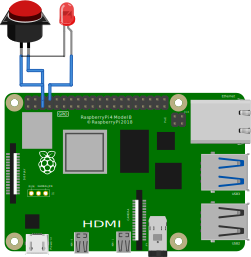

<h1 align="center">

Welcome to NAK_streamLink 👋

</h1>
<p>

<a href="https://github.com/fehart20/NAK_streamLink" target="_blank"></a>
<a href="https://github.com/fehart20/NAK_streamLink/graphs/commit-activity" target="_blank"></a>
<a href="None" target="_blank"></a>

</p>

> Python-App to view YouTube livestreams without the need of any user interaction other than a click of a button.
### 🏠 [Homepage](https://github.com/fehart20/NAK_streamLink)

## Hardware
 - Raspberry Pi 4 (4GB)
 - SD card (min. 8GB)
 - Power Supply
 - Button with LED
 - (Colling-)Case for die Pi
 - Plastic Box with cable outlet to safely mount the Pi
 - Ethernet cable
 - Mini-HDMI to HDMI cable

### Cabling
From|To
---|---
Button/LED Gnd|GND (Port 6)
Button (+)|GPIO 3 (SCL)
LED (+)|GPIO 14 (TXD)



## Installation
 1. Flash *Raspbian Desktop* to the SD card via *Raspberry Pi Imager*
 2. **IMPORTANT:** Set it up with the following credentials and settings:
	 - Username: *nak-watchdog*
	 - Password: *VAULT*
	 - Turn on *Auto Login*
	 - Hostname: *nak-streamLink-n* (Replace *n* with the corresponding number from the deployment sheet)
3. Clone this repository into ```/home/nak-watchdog/``` via  
	```bash
	git clone https://github.com/fehart20/NAK_streamLink.git
	```
4. Run the installation script via  
	```bash
	./NAK_streamLink/streamLink/scripts/install.sh
	```
5. You need to enable the Serial-Function for the button LED to work: (Settings?)
	```bash
	sudo echo 'enable_uart=1' >> /boot/config.txt 
	```

## Configuration
To configure the YouTube-Livestream Link (or better: a dynamically changed shortlink) use the config-script as follows:
```bash
./NAK_streamLink/streamLink/scripts/config.sh
```
There are some predefined Links but you can also provide your own link by selecting 'Others'.  
The script generates an entry inside ```./NAK_streamLink/streamLink/config.ini```.

---
## Updating
To Update *streamLink* simply run the following command in ```~```:  
```bash
./NAK_streamLink/streamLink/scripts/update.sh
```
This will pull all the changes from this repository. **Please be aware that all localy made changes will be lost.**

## Author
👤 **FHCOM**
* Website: https://fhcom.de

* GitHub: [@fehart20](https://github.com/{github_username})


## 🤝 Contributing
Contributions, issues and feature requests are welcome!<br />Feel free to check [issues page](https://github.com/fehart20/NAK_streamLink/issues). You can also take a look at the [contributing guide](None)
## Show your support
Give a ⭐️ if this project helped you!